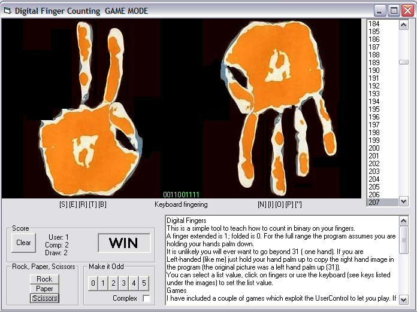



## Binary Finger Counting \(User Control version\)

### Description

Teach yourself to count in binary on your fingers.

Includes a couple of simple finger games, let me know if you develop others and I'll add them.

Converted earlier program to use a tidier UserControl. Fixed a logic error one of the games.
 
### More Info
 

             |
---                |---
**Submitted On**   |2004-04-14 00:49:04
**By**             |[Roger Gilchrist](https://github.com/Planet-Source-Code/PSCIndex/blob/master/ByAuthor/roger-gilchrist.md)
**Level**          |Intermediate
**User Rating**    |5.0 (10 globes from 2 users)
**Compatibility**  |VB 6\.0
**Category**       |[Math/ Dates](https://github.com/Planet-Source-Code/PSCIndex/blob/master/ByCategory/math-dates__1-37.md)
**World**          |[Visual Basic](https://github.com/Planet-Source-Code/PSCIndex/blob/master/ByWorld/visual-basic.md)
**Archive File**   |[Binary\_Fin1733184142004\.zip](https://github.com/Planet-Source-Code/roger-gilchrist-binary-finger-counting-user-control-version__1-53140/archive/master.zip)

